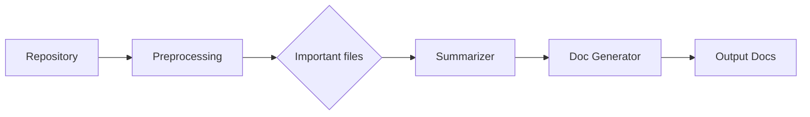

# Mermaid Examples

Example flow returned from docgen:

```mermaid
flowchart LR
  A[Repository] --> B[Preprocessing]
  B --> C{Important files}
  C --> D[Summarizer]
  D --> E[Doc Generator]
  E --> F[Output Docs]
```
